# Heart Disease Prediction — MLOps Project Report

**Repository:** https://github.com/rajsingha/heart-disease-mlops

---

## 1. Project overview

The goal of this project was to take a machine learning model from raw data all
the way to a deployed, monitored API using standard MLOps practices. I used the
UCI Heart Disease dataset to train a binary classifier that predicts whether a
patient has heart disease, and then built everything around it: experiment
tracking with MLflow, unit tests, a CI pipeline on GitHub Actions, a Docker
image, a Kubernetes deployment, and basic monitoring with Prometheus and
Grafana.

The final model is a tuned logistic regression with a test ROC-AUC of 0.96. It
is served by a FastAPI app with a `/predict` endpoint that takes patient data
as JSON and returns the prediction along with a probability.

### Architecture

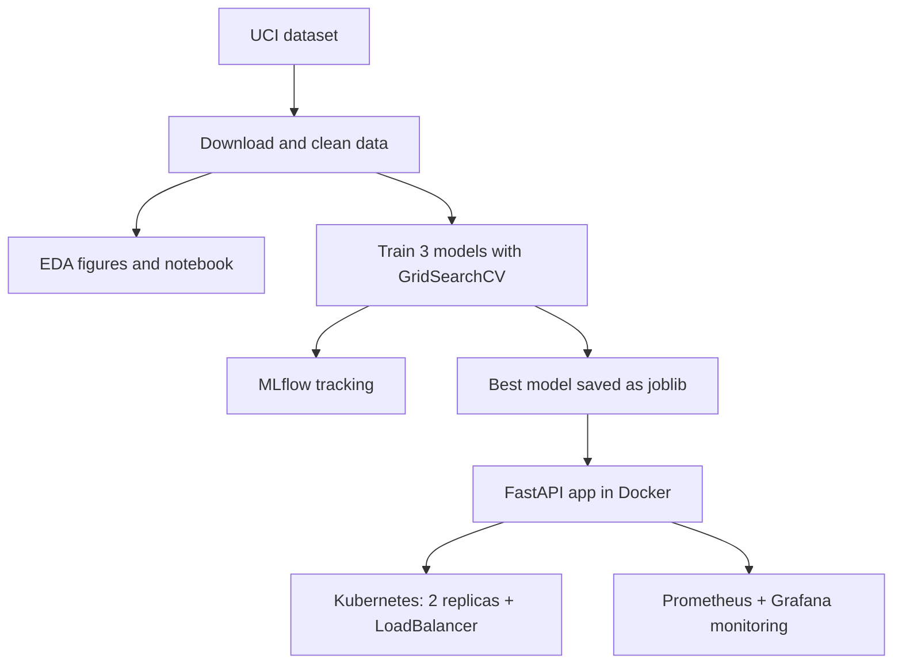

The same flow in plain text:

```
UCI dataset
   -> download + clean (src/data)
   -> EDA (src/eda.py, notebook)
   -> training with GridSearchCV (src/models/train.py)
        -> runs logged to MLflow
        -> best model saved to models/model.joblib
   -> FastAPI app (src/api) packaged into a Docker image
        -> deployed on Kubernetes (2 replicas, LoadBalancer)
        -> scraped by Prometheus, viewed in Grafana

CI on every push: ruff -> pytest -> train -> docker build + smoke test
```

---

## 2. Dataset

I used the Cleveland subset of the UCI Heart Disease dataset: 303 patients and
13 clinical features. The original label (`num`) goes from 0 to 4, so I
converted it to a binary target where 1 means any presence of heart disease.

| Feature | Description | Type |
|---|---|---|
| age | Age in years | numeric |
| sex | 1 = male, 0 = female | binary |
| cp | Chest pain type (1-4, 4 = asymptomatic) | categorical |
| trestbps | Resting blood pressure (mm Hg) | numeric |
| chol | Serum cholesterol (mg/dl) | numeric |
| fbs | Fasting blood sugar > 120 mg/dl | binary |
| restecg | Resting ECG result (0-2) | categorical |
| thalach | Maximum heart rate achieved | numeric |
| exang | Exercise-induced angina | binary |
| oldpeak | ST depression (exercise vs rest) | numeric |
| slope | Slope of peak exercise ST segment (1-3) | categorical |
| ca | Major vessels colored by fluoroscopy (0-3) | numeric |
| thal | Thalassemia (3/6/7) | categorical |

The download is scripted in `src/data/download.py`. It first tries the
`ucimlrepo` package and falls back to the raw file on the UCI archive if that
fails, so the raw data can always be rebuilt from a fresh checkout. I also
committed the cleaned CSV under `data/processed/` so the CI pipeline can
retrain the model without depending on the UCI servers being up.

---

## 3. EDA findings

The figures are generated by `python -m src.eda` into `reports/figures/`, and
the same analysis can be run interactively in `notebooks/eda.ipynb`.

The main things I found:

1. The classes are close to balanced: 164 patients without disease (54.1%) and
   139 with disease (45.9%). Because of this I didn't do any resampling and
   just used stratified splits (see `class_distribution.png`).
2. Missing values are rare. Only `ca` (4 rows) and `thal` (2 rows) have them,
   written as `?` in the raw file. I impute them inside the model pipeline
   (median for numeric, most frequent for categorical) so the imputers are
   fitted only on training data and there is no leakage
   (see `missing_values.png`).
3. Some features separate the classes clearly. Patients with disease reach
   lower maximum heart rates, show more ST depression during exercise, and
   have more vessels colored during fluoroscopy (see `histograms_numeric.png`).
4. On the categorical side, asymptomatic chest pain (cp = 4), exercise-induced
   angina, a flat or down-sloping ST segment, and a reversible thalassemia
   defect (thal = 7) all come with much higher disease rates
   (see `categorical_vs_target.png`).
5. The correlation heatmap showed no pair of features above roughly 0.6, so I
   kept all of them (see `correlation_heatmap.png`).

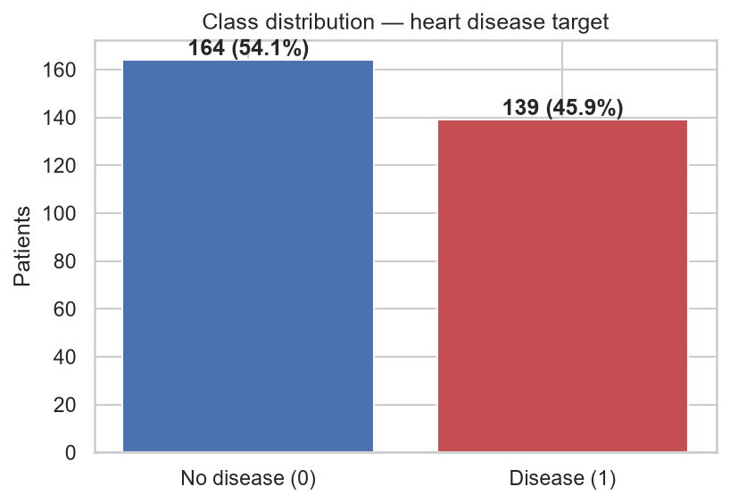

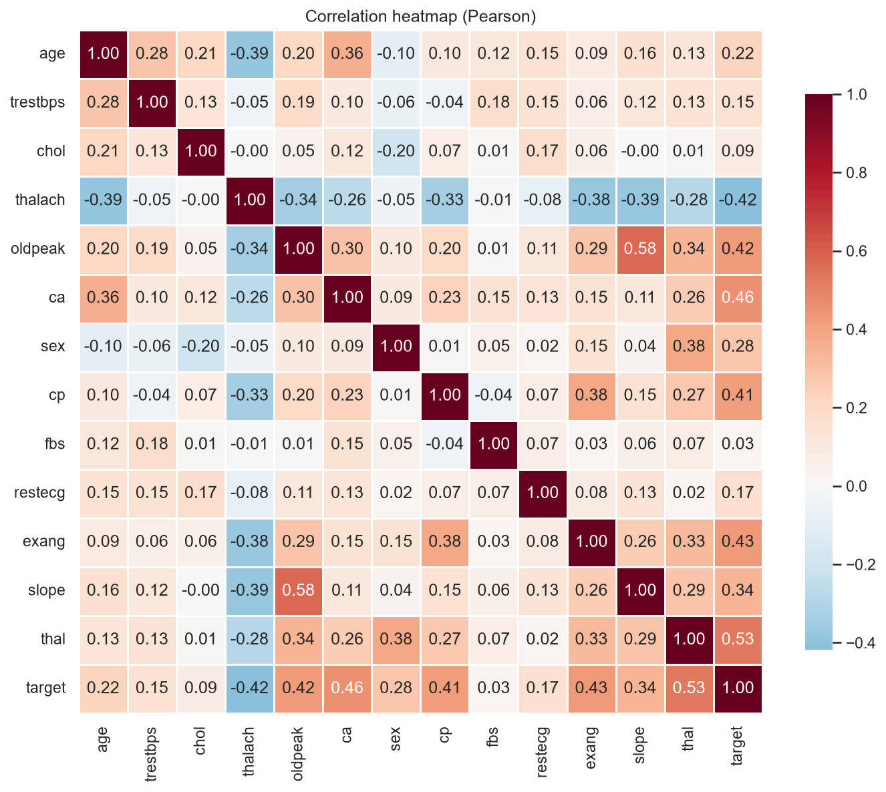

---

## 4. Preprocessing and feature engineering

All preprocessing lives in a single sklearn `ColumnTransformer`
(`src/data/preprocess.py`) that becomes the first step of every model pipeline:

- numeric features (`age, trestbps, chol, thalach, oldpeak, ca`): median
  imputation, then standard scaling
- categorical features (`sex, cp, fbs, restecg, exang, slope, thal`): most
  frequent imputation, then one-hot encoding with `handle_unknown="ignore"`

The important design choice here is that the transformer is saved inside the
pipeline itself. The API loads one joblib file and can feed raw JSON values
straight into it. There is no second preprocessing implementation that could
drift away from the training code.

The data is split 80/20 with stratification and a fixed random seed (42). All
hyperparameter tuning happens with cross-validation inside the training split,
and the test set is only used at the end for the final comparison.

---

## 5. Model development and comparison

I tuned three model families with `GridSearchCV`, using stratified 5-fold
cross-validation and refitting on ROC-AUC (`src/models/train.py`):

| Family | Grid | Best params |
|---|---|---|
| Logistic Regression | C in {0.01, 0.1, 1, 10}, L1/L2 penalty | C = 1.0, L2 |
| Random Forest | 200/400 trees, depth None/5/10, min_split 2/5 | 200 trees, depth 5, min_split 5 |
| XGBoost | 200/400 trees, depth 3/5, lr 0.05/0.1 | 200 trees, depth 3, lr 0.05 |

Results on the held-out test set (61 patients, full table in
`reports/model_comparison.csv`):

| Model | CV ROC-AUC | Test ROC-AUC | Accuracy | Precision | Recall | F1 |
|---|---|---|---|---|---|---|
| Logistic Regression | 0.908 ± 0.018 | 0.960 | 0.869 | 0.813 | 0.929 | 0.867 |
| Random Forest | 0.901 ± 0.025 | 0.949 | 0.885 | 0.839 | 0.929 | 0.881 |
| XGBoost | 0.865 ± 0.029 | 0.944 | 0.869 | 0.813 | 0.929 | 0.867 |

I picked logistic regression. It has the best cross-validated and test ROC-AUC
and the lowest variance across folds. With only 303 rows the tree ensembles
don't get to use their extra capacity, and the simpler linear model is less
likely to overfit. Recall is high (0.93), which matters for a screening
scenario where missing a sick patient is worse than a false alarm. The
coefficients are also easy to interpret, which is a plus in a medical setting.

Confusion matrices and ROC curves for all three models are saved in
`reports/figures/` and attached to the MLflow runs. These are the plots for
the selected logistic regression model:

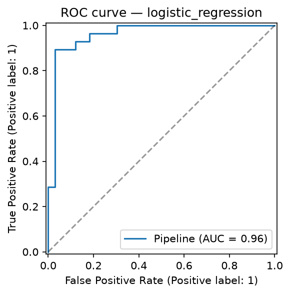

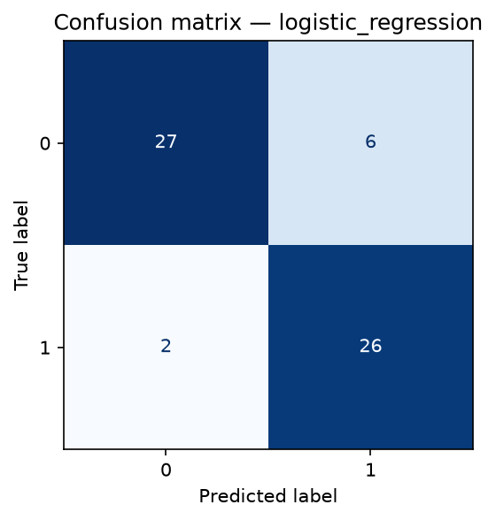

---

## 6. Experiment tracking with MLflow

Each model family gets its own MLflow run (local sqlite store `mlflow.db`,
artifacts under `mlruns/`). For every run I log:

- the best hyperparameters and the CV configuration
- cross-validation means for accuracy, precision, recall, F1 and ROC-AUC, plus
  the ROC-AUC standard deviation
- all test metrics
- the confusion matrix and ROC curve as PNGs, a text classification report,
  and the fitted pipeline itself via `mlflow.sklearn.log_model`

The UI can be started with `mlflow ui --backend-store-uri sqlite:///mlflow.db`.

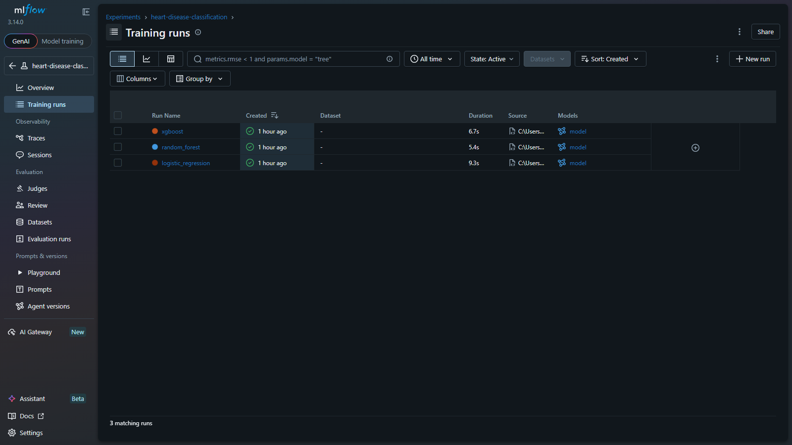

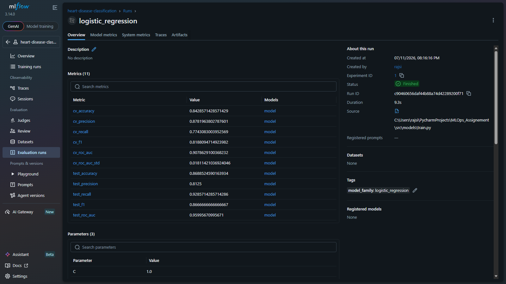

Next to the MLflow store, the winning pipeline is exported to
`models/model.joblib` together with `models/model_metadata.json`, which records
the metrics, hyperparameters, library versions, training timestamp and the
MLflow run id. The API reads this file and reports the model family in its
`/health` response.

---

## 7. Packaging and reproducibility

- `requirements.txt` pins the full training environment.
- `requirements-api.txt` pins only what the serving container needs. The
  scikit-learn and xgboost versions match the training environment exactly so
  the pickled pipeline loads identically.
- The preprocessing and the model are one artifact, so there is no way to serve
  the model with the wrong preprocessing.
- The cleaned dataset is committed and every random operation uses seed 42, so
  training is reproducible. CI proves this by retraining from scratch on every
  push.
- Each stage is runnable as a module (`python -m src.data.download`,
  `python -m src.models.train`, and so on).

---

## 8. CI/CD pipeline

The GitHub Actions workflow (`.github/workflows/ci.yml`) runs on every push and
pull request to `main`. It has four jobs that run in sequence, and a failure in
any job stops the rest:

| Job | What it does |
|---|---|
| Lint | `ruff check src tests` |
| Test | runs the 24 pytest tests (data cleaning, pipeline, training, MLflow logging, API) |
| Train | retrains from the committed cleaned CSV and uploads the model, MLflow store and reports as artifacts |
| Docker | builds the image with the fresh model, starts the container, waits for `/health`, and POSTs a sample patient to `/predict` |

The tests run against synthetic data generated in `tests/conftest.py`, so they
don't need network access or a pre-trained model.

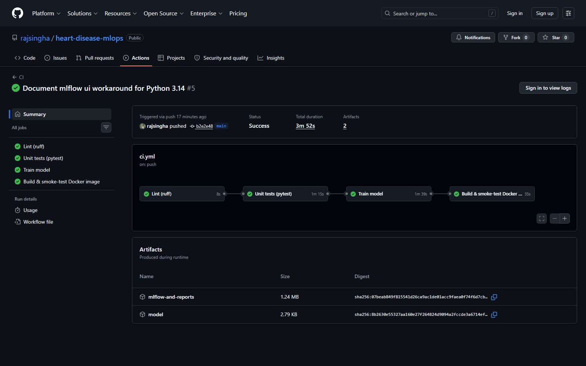

---

## 9. Containerization

The `Dockerfile` starts from `python:3.12-slim`, installs the pinned serving
dependencies, copies `src/` and the trained model, and runs uvicorn as a
non-root user. A `HEALTHCHECK` hits `/health` every 30 seconds.

I verified it locally:

```
docker build -t heart-disease-api:latest .
docker run --rm -p 8000:8000 heart-disease-api:latest

curl http://localhost:8000/health
{"status":"ok","model_loaded":true,"model_family":"logistic_regression"}

curl -X POST http://localhost:8000/predict -H "Content-Type: application/json" -d @patient.json
{"prediction":1,"label":"heart_disease","probability":0.8986,"model_family":"logistic_regression"}
```

The container returns exactly the same prediction as the local environment,
which was the point of the exercise.

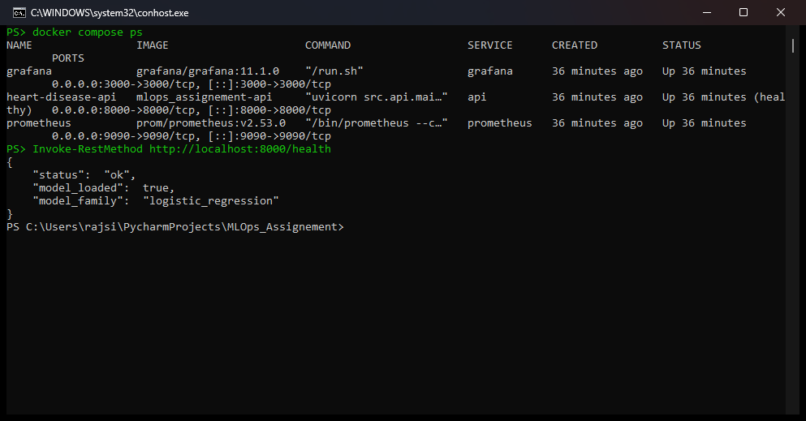

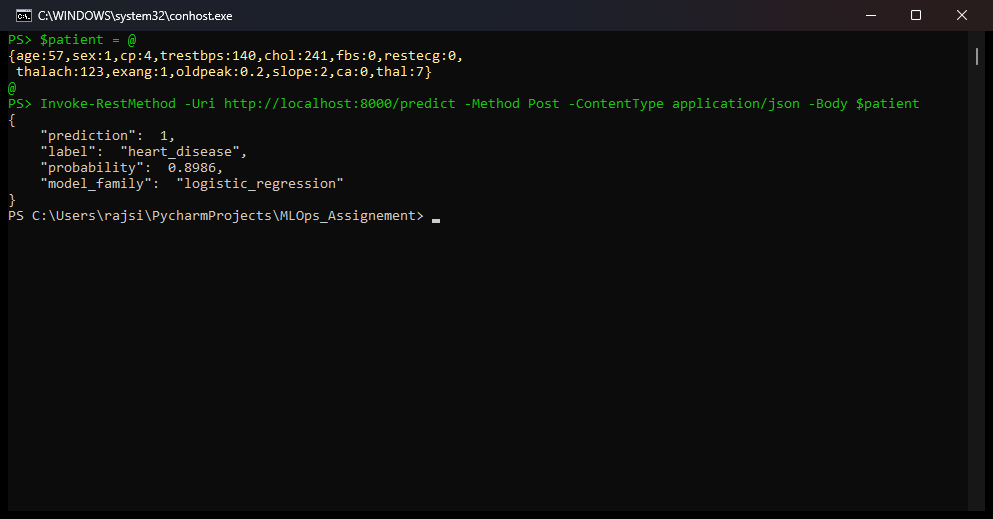

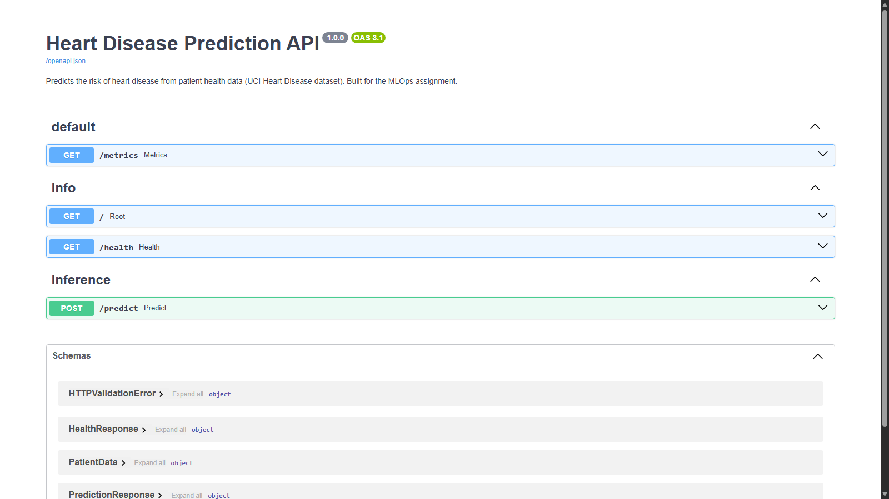

---

## 10. Kubernetes deployment

`k8s/deployment.yaml` runs 2 replicas with CPU/memory requests and limits, and
readiness/liveness probes on `/health`. `k8s/service.yaml` exposes them through
a LoadBalancer on port 80. I deployed on Docker Desktop Kubernetes, where the
LoadBalancer binds to localhost; on Minikube you would use
`minikube service heart-disease-api --url` instead, and on a cloud cluster it
becomes a real load balancer.

```
kubectl apply -f k8s/deployment.yaml -f k8s/service.yaml
kubectl get pods,svc -l app=heart-disease-api
```

Both pods came up healthy and `/predict` works through the service. The full
walkthrough is in `k8s/README.md`.

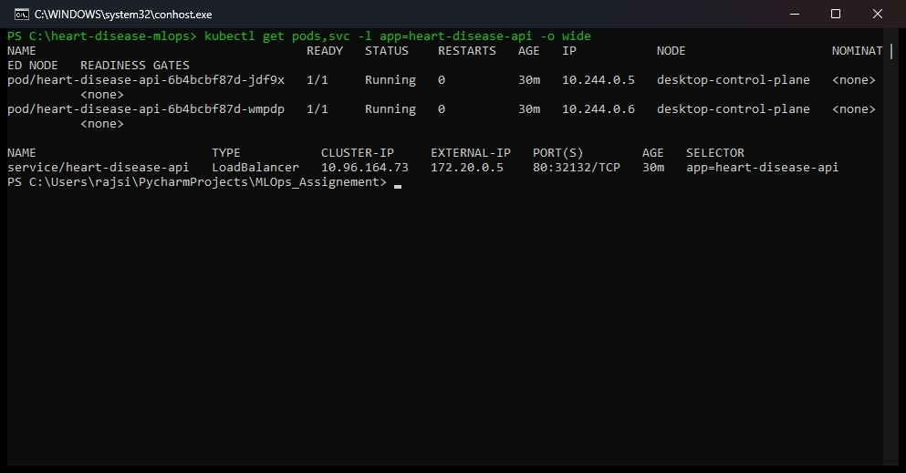

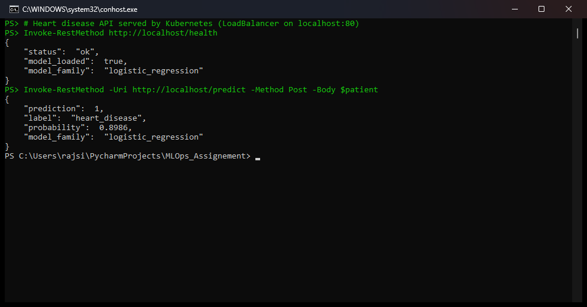

---

## 11. Monitoring and logging

Three layers of visibility:

1. A logging middleware in the API writes one line per request with the
   method, path, status code and latency. Predictions are also logged with
   their probability.
2. The `/metrics` endpoint exposes Prometheus metrics: standard HTTP request
   counters and latency histograms, plus a custom
   `model_predictions_total{predicted_class=...}` counter. Watching the class
   mix of predictions over time is a cheap early warning for data drift.
3. `docker compose up --build` starts the API together with Prometheus and
   Grafana. Grafana is provisioned automatically with a dashboard showing
   request rate, p95 latency, predictions by class and HTTP status codes.

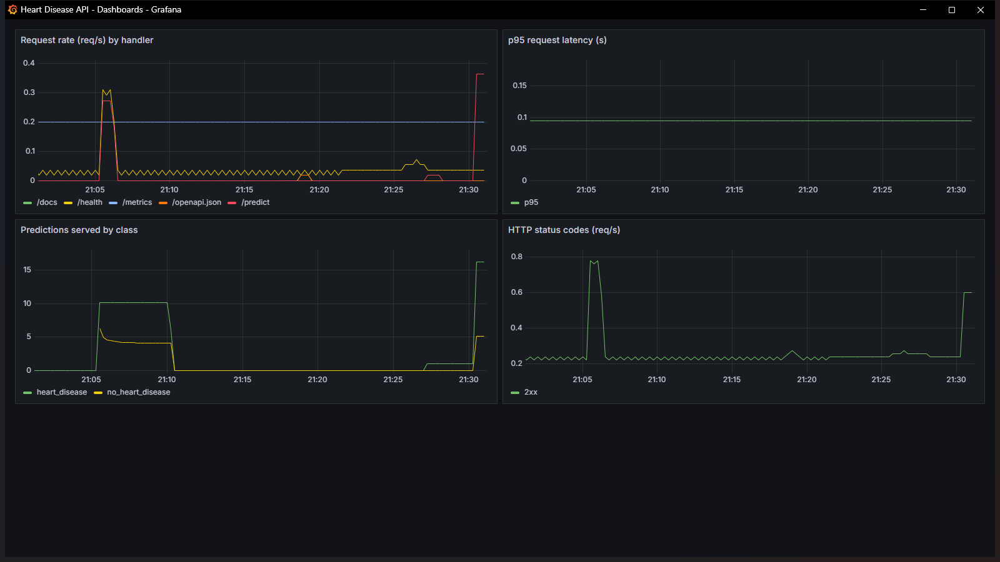

For an ML service this is more than uptime monitoring. A shift in the
prediction distribution or a latency regression usually shows up here long
before anyone looks at model accuracy again.

---

## 12. Setup instructions

The short version (Python 3.12+, more detail in the README):

```bash
python -m venv .venv
.venv\Scripts\activate              # on Linux/macOS: source .venv/bin/activate
pip install -r requirements.txt

python -m src.data.download
python -m src.data.preprocess
python -m src.eda
python -m src.models.train

pytest -v
ruff check src tests

uvicorn src.api.main:app --port 8000
```

Swagger UI is at http://localhost:8000/docs once the server is running.

---

## 13. Deliverables checklist

| Deliverable | Location |
|---|---|
| Source code, Dockerfile, requirements | repo root, `src/`, `Dockerfile`, `requirements*.txt` |
| Cleaned dataset + download script | `data/processed/`, `src/data/download.py` |
| EDA notebook and scripts | `notebooks/eda.ipynb`, `src/eda.py` |
| Unit tests | `tests/` (24 tests) |
| GitHub Actions workflow | `.github/workflows/ci.yml` |
| Deployment manifests | `k8s/` |
| Monitoring config | `monitoring/`, `docker-compose.yml` |
| Screenshots | `screenshots/` |
| Report | this document |
| API access | http://localhost:8000 locally, or through the k8s LoadBalancer |
