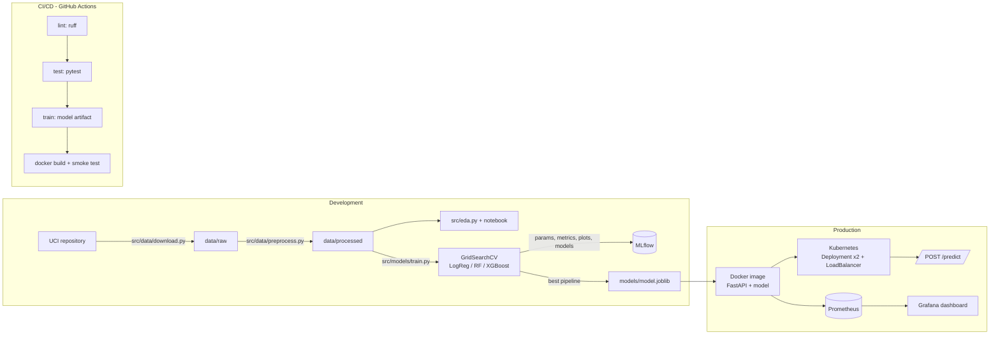

# Heart Disease Prediction — MLOps Project Report

**Course:** MLOps Experimental Learning Assignment
**Author:** Raj Singha
**Date:** July 2026
**Repository:** https://github.com/rajsingha/heart-disease-mlops

---

## 1. Project overview

This project builds, tracks, packages, and deploys a machine-learning classifier
that predicts the risk of heart disease from patient health data, following
production MLOps practices end to end:

- **Data & EDA** — automated download of the UCI Heart Disease dataset, scripted
  and notebook-based exploratory analysis.
- **Modelling** — a reusable sklearn preprocessing pipeline plus three tuned
  model families (Logistic Regression, Random Forest, XGBoost) compared with
  stratified 5-fold cross-validation.
- **Experiment tracking** — every tuning run logged to MLflow (parameters,
  metrics, plots, serialized models).
- **Serving** — a FastAPI `/predict` endpoint returning prediction +
  probability, with request logging and Prometheus metrics.
- **Automation** — pytest suite and a GitHub Actions pipeline
  (lint → test → train → Docker build + smoke test) that fails on any error.
- **Deployment** — a slim Docker image and Kubernetes manifests
  (Deployment + LoadBalancer Service) that run on Docker Desktop, Minikube, or
  any cloud cluster.
- **Monitoring** — Prometheus scraping + an auto-provisioned Grafana dashboard
  via `docker compose up`.

### Architecture



Text fallback:

```
UCI data ──▶ download.py ──▶ preprocess.py ──▶ cleaned CSV ──▶ EDA figures
                                   │
                                   ▼
                       train.py (GridSearchCV x 3 families)
                          │                    │
                          ▼                    ▼
                    MLflow tracking      models/model.joblib
                                               │
              GitHub Actions: ruff ▶ pytest ▶ train ▶ docker smoke-test
                                               │
                                               ▼
                    Docker image (FastAPI) ──▶ Kubernetes (2 replicas + LB)
                                               │
                              /metrics ──▶ Prometheus ──▶ Grafana
```

---

## 2. Dataset

**UCI Heart Disease** (Cleveland subset) — 303 patients, 13 clinical features,
and a 0–4 diagnosis label binarised to `target` (1 = disease present).

| Feature | Description | Type |
|---|---|---|
| age | Age in years | numeric |
| sex | 1 = male, 0 = female | binary |
| cp | Chest pain type (1–4; 4 = asymptomatic) | categorical |
| trestbps | Resting blood pressure (mm Hg) | numeric |
| chol | Serum cholesterol (mg/dl) | numeric |
| fbs | Fasting blood sugar > 120 mg/dl | binary |
| restecg | Resting ECG result (0–2) | categorical |
| thalach | Maximum heart rate achieved | numeric |
| exang | Exercise-induced angina | binary |
| oldpeak | ST depression (exercise vs rest) | numeric |
| slope | Slope of peak exercise ST segment (1–3) | categorical |
| ca | Major vessels colored by fluoroscopy (0–3) | numeric |
| thal | Thalassemia (3/6/7) | categorical |

Acquisition is scripted (`python -m src.data.download`): it fetches via the
`ucimlrepo` package with a direct-URL fallback, so a clean checkout can always
rebuild the raw data. The cleaned CSV is additionally committed under
`data/processed/` so CI can retrain without network access to UCI.

---

## 3. EDA findings

All figures are generated by `python -m src.eda` into `reports/figures/` and
reproduced interactively in `notebooks/eda.ipynb` (executed with outputs).

1. **Near-balanced classes** — 164 (54.1%) no-disease vs 139 (45.9%) disease.
   No resampling needed; stratified splits preserve the ratio.
   *(figure: class_distribution.png)*
2. **Minimal missingness** — only `ca` (4 rows) and `thal` (2 rows) contain
   missing values (raw `?` markers). They are imputed inside the model
   pipeline — median for numeric, most-frequent for categorical — fitted on
   training folds only, so no leakage. *(figure: missing_values.png)*
3. **Strong univariate signal** — patients with disease reach clearly lower
   maximum heart rates (`thalach`), show larger exercise-induced ST depression
   (`oldpeak`), and more fluoroscopy-colored vessels (`ca`).
   *(figure: histograms_numeric.png)*
4. **Categorical risk factors** — asymptomatic chest pain (`cp = 4`),
   exercise-induced angina (`exang = 1`), flat/down-sloping ST (`slope ≥ 2`),
   and reversible-defect thalassemia (`thal = 7`) all carry markedly higher
   disease rates. *(figure: categorical_vs_target.png)*
5. **No problematic multicollinearity** — the strongest pairwise correlation is
   ≈ 0.6; all features are retained. *(figure: correlation_heatmap.png)*

---

## 4. Preprocessing & feature engineering

A single sklearn `ColumnTransformer` is embedded as the first step of every
model pipeline (`src/data/preprocess.py`), guaranteeing identical
transformations at training and inference time:

- **Numeric** (`age, trestbps, chol, thalach, oldpeak, ca`):
  `SimpleImputer(median)` → `StandardScaler`
- **Categorical** (`sex, cp, fbs, restecg, exang, slope, thal`):
  `SimpleImputer(most_frequent)` → `OneHotEncoder(handle_unknown="ignore",
  drop="if_binary")`

Because the transformer is *inside* the persisted pipeline, the API deserializes
one artifact (`models/model.joblib`) and feeds it raw JSON features directly —
no separate preprocessing code path to drift out of sync.

Data are split 80/20 with stratification (`random_state = 42`) before any
fitting; all tuning happens via cross-validation inside the training split.

---

## 5. Model development & comparison

Three model families were tuned with `GridSearchCV` (stratified 5-fold CV,
refit on ROC-AUC) in `src/models/train.py`:

| Family | Grid | Best params |
|---|---|---|
| Logistic Regression | C ∈ {0.01, 0.1, 1, 10} × penalty {L1, L2} | C = 1.0, L2 |
| Random Forest | trees {200, 400} × depth {None, 5, 10} × min_split {2, 5} | 200 trees, depth 5, min_split 5 |
| XGBoost | trees {200, 400} × depth {3, 5} × lr {0.05, 0.1} | 200 trees, depth 3, lr 0.05 |

**Results** (held-out test set, n = 61; full table in `reports/model_comparison.csv`):

| Model | CV ROC-AUC (±σ) | Test ROC-AUC | Accuracy | Precision | Recall | F1 |
|---|---|---|---|---|---|---|
| **Logistic Regression** | **0.908 ± 0.018** | **0.960** | 0.869 | 0.813 | 0.929 | 0.867 |
| Random Forest | 0.901 ± 0.025 | 0.949 | 0.885 | 0.839 | 0.929 | 0.881 |
| XGBoost | 0.865 ± 0.029 | 0.944 | 0.869 | 0.813 | 0.929 | 0.867 |

**Selection: Logistic Regression.** It achieves the best cross-validated and
test ROC-AUC with the lowest variance across folds, and — on a 303-row dataset —
the simpler, better-calibrated linear model is less likely to overfit than the
tree ensembles, whose extra capacity brings no measurable gain here. Its high
recall (0.93) is the right trade-off for a screening use case, where missing a
diseased patient is costlier than a false alarm. Interpretable coefficients are
a bonus in a clinical context.

Confusion matrices and ROC curves for every family are in `reports/figures/`
and attached to each MLflow run.

---

## 6. Experiment tracking (MLflow)

`src/models/train.py` logs one MLflow run per model family to the local
tracking store (`sqlite:///mlflow.db`, artifacts under `./mlruns`):

- **Parameters** — best hyper-parameters + CV configuration
- **Metrics** — CV means (accuracy, precision, recall, F1, ROC-AUC, ROC-AUC σ)
  and all held-out test metrics
- **Artifacts** — confusion matrix PNG, ROC curve PNG, text classification
  report, and the fitted sklearn pipeline (`mlflow.sklearn.log_model`)

Inspect with `mlflow ui --backend-store-uri sqlite:///mlflow.db`
(screenshot placeholder: `screenshots/mlflow_runs.png`).

The exported winner is also written to `models/model.joblib` with
`models/model_metadata.json` capturing metrics, hyper-parameters, library
versions, timestamp, and the source MLflow run id — a lightweight model card
that the API surfaces via `/health`.

---

## 7. Model packaging & reproducibility

- `requirements.txt` — full training/dev environment (flexible minimums)
- `requirements-api.txt` — exact pins for serving, matching training versions
  of scikit-learn/xgboost so the pickle deserializes identically
- Pipeline + preprocessing serialized as **one** joblib artifact
- `data/processed/` committed → CI retrains deterministically
  (`random_state = 42` everywhere)
- Every pipeline stage is a module entry point (`python -m src...`), verified
  from a clean checkout by CI

---

## 8. CI/CD pipeline (GitHub Actions)

`.github/workflows/ci.yml`, triggered on push/PR to `main`
(screenshot placeholder: `screenshots/ci_pipeline.png`):

| Stage | What it does | Fails the pipeline on |
|---|---|---|
| **Lint** | `ruff check src tests` | style/quality violations |
| **Test** | `pytest` — 24 tests over cleaning, pipeline, training, MLflow logging, API contract | any test failure |
| **Train** | retrains from the committed cleaned CSV; uploads model, MLflow store, and evaluation reports as artifacts | training error |
| **Docker** | builds the image with the fresh model, boots the container, polls `/health`, POSTs to `/predict` and validates the response | build or smoke-test failure |

Stages are chained with `needs:` so a failure stops everything downstream, and
each workflow run keeps its artifacts (model + reports) for traceability.
Tests use deterministic synthetic data, so they need no network or pre-trained
model.

---

## 9. Containerization

`Dockerfile` builds a slim serving image from `python:3.12-slim`: pinned
serving deps → `src/` → trained model, running as a non-root user with a
container `HEALTHCHECK` hitting `/health`.

Verified locally:

```
docker build -t heart-disease-api:latest .
docker run --rm -p 8000:8000 heart-disease-api:latest
curl http://localhost:8000/health
  → {"status":"ok","model_loaded":true,"model_family":"logistic_regression"}
curl -X POST http://localhost:8000/predict -d '{...patient json...}'
  → {"prediction":1,"label":"heart_disease","probability":0.8986,...}
```

(screenshot placeholder: `screenshots/docker_run.png`)

---

## 10. Deployment (Kubernetes)

`k8s/deployment.yaml` + `k8s/service.yaml` deploy the image with:

- 2 replicas, CPU/memory requests & limits
- readiness + liveness probes on `/health` (a pod that loses its model is
  restarted and removed from the Service until healthy)
- Prometheus scrape annotations
- a `LoadBalancer` Service (port 80 → 8000) — on Docker Desktop it binds
  `localhost`; on Minikube use `minikube service heart-disease-api --url`;
  on EKS/GKE/AKS it provisions a cloud load balancer

Step-by-step instructions: [`k8s/README.md`](../k8s/README.md)
(screenshot placeholders: `screenshots/kubectl_get_pods.png`,
`screenshots/k8s_predict.png`).

---

## 11. Monitoring & logging

- **Request logging** — middleware logs method, path, status, and latency for
  every request; predictions are logged with their probability.
- **Prometheus metrics** — `/metrics` exposes HTTP request counts/latency
  histograms (via `prometheus-fastapi-instrumentator`) plus a custom
  `model_predictions_total{predicted_class=...}` counter, giving a live view of
  the served class mix — a cheap first-order data-drift signal.
- **Grafana** — `docker compose up --build` starts API + Prometheus + Grafana
  with an auto-provisioned dashboard (request rate, p95 latency, predictions by
  class, HTTP status codes). Grafana: http://localhost:3000 (admin/admin).
  (screenshot placeholder: `screenshots/grafana_dashboard.png`)

In an ML system this matters beyond uptime: latency regressions, error spikes,
and shifts in the prediction distribution are early symptoms of model or data
problems that accuracy metrics alone won't reveal until retraining.

---

## 12. Setup instructions

See [README.md](../README.md) for the full quickstart. Summary from a clean
checkout (Python 3.12+):

```bash
python -m venv .venv && source .venv/bin/activate   # Windows: .venv\Scripts\activate
pip install -r requirements.txt
python -m src.data.download && python -m src.data.preprocess
python -m src.eda
python -m src.models.train
pytest -v && ruff check src tests
uvicorn src.api.main:app --port 8000                # or: docker build + run
```

---

## 13. Deliverables checklist

| Deliverable | Location |
|---|---|
| Source code, Dockerfile, requirements | repo root, `src/`, `Dockerfile`, `requirements*.txt` |
| Cleaned dataset + download script | `data/processed/`, `src/data/download.py` |
| EDA notebook + scripts | `notebooks/eda.ipynb`, `src/eda.py` |
| Unit tests | `tests/` (24 tests) |
| GitHub Actions workflow | `.github/workflows/ci.yml` |
| Deployment manifests | `k8s/` |
| Monitoring config | `monitoring/`, `docker-compose.yml` |
| Screenshots | `screenshots/` (see its README for the capture list) |
| Report | this document (`docs/REPORT.md`) |
| API access | `http://localhost:8000` local / k8s LoadBalancer; Swagger at `/docs` |

---

## 14. Limitations & future work

- 303 rows is small; the test set (61) gives noisy point estimates — the CV
  numbers are the more reliable comparison.
- The model registry could move from a metadata JSON to MLflow Model Registry
  backed by a shared database for staged promotion (staging → production).
- Retraining is manual/CI-triggered; a scheduled pipeline with data-drift
  detection (e.g., population-stability index on incoming `/predict` payloads)
  would close the loop.
- Probability calibration (Platt/isotonic) would strengthen the clinical
  usefulness of the returned confidence scores.
